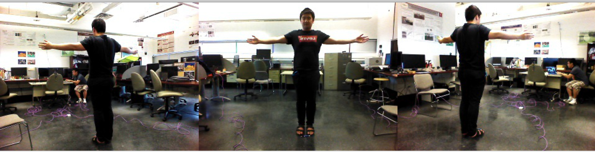
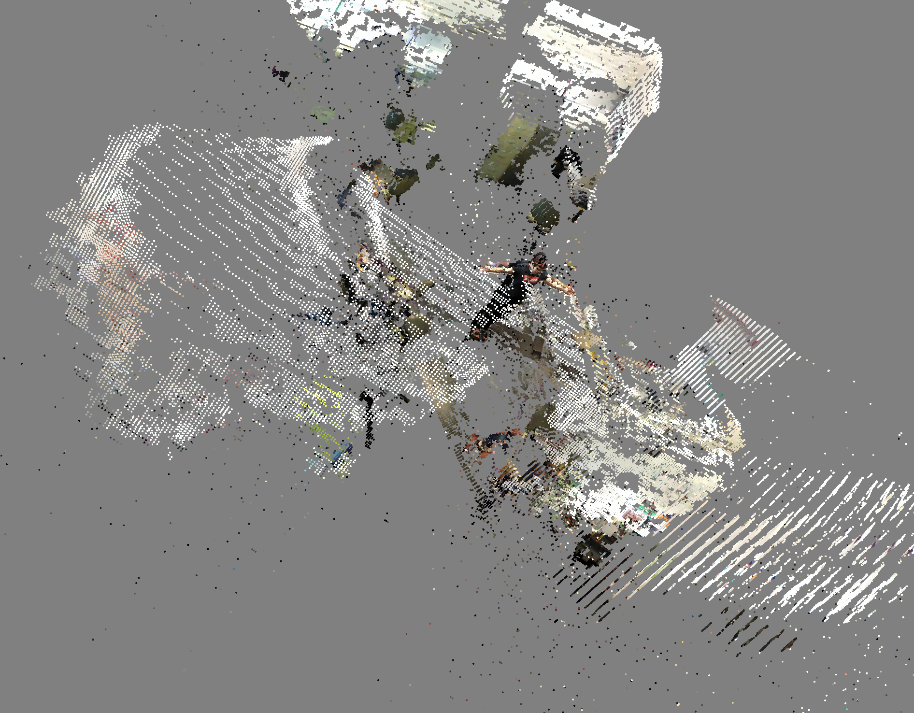
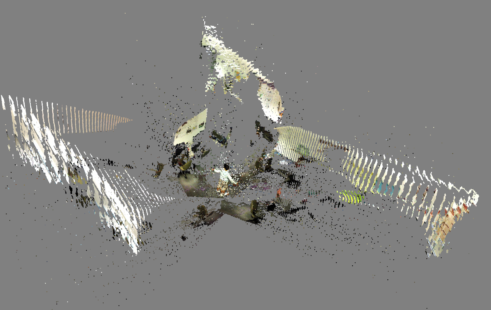
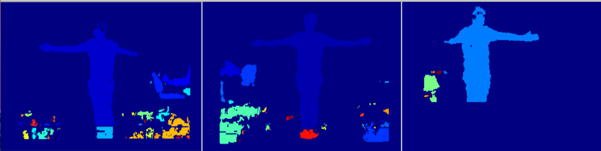
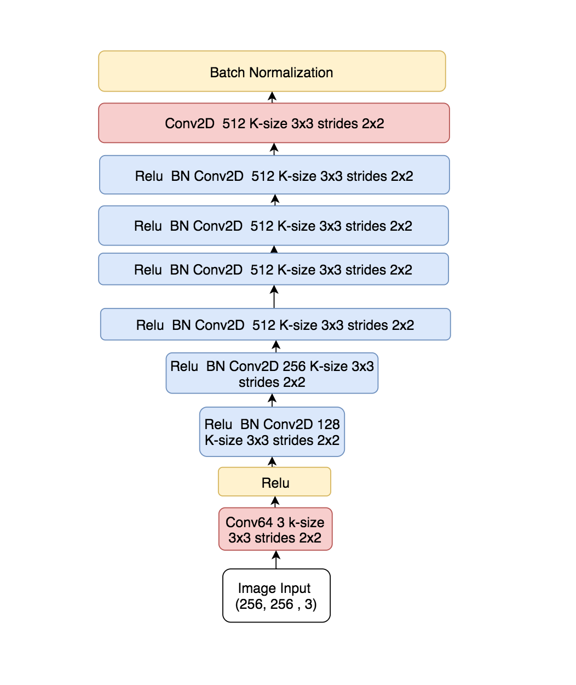
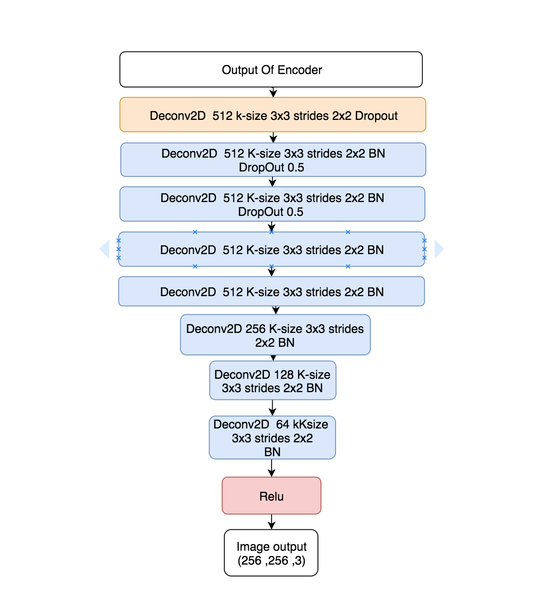
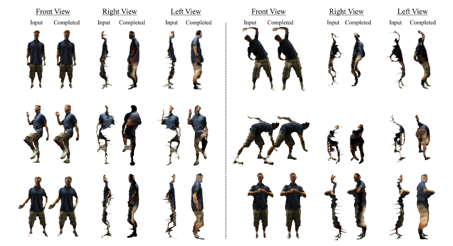

# RGBD Research Project

## OverView

- Building `RGB` additive color with supervised machine learning.

## Multi-View 3D visualization

-  

  - Original Input image from three POV, which will be masked by depth data. Then OpenCV filtering.

- origin author [PoKong Lai](http://pokonglai.com)

- Visualizating the 3D output to ensure the Camera Poses was properly predicted.

  - 
  - 

- This Visualizes the environment with three relative camera locations.

- The major challenges is how to synchronizes these camera. So we uses SLAM and VR point-cloud scattering to predict the poses.

## Preprocessing

- Recording a person from three point of views. And perform __loop closure__ to predict the camera poses of these POV.

    - 
      - This is the initial mask that will be selected. For each image we will compute similarity to pick the most same components as filter.

## Result Video

- network architecture
  - 
  - 

- [link](https://www.youtube.com/watch?v=_PoYJkJvj_k&feature=youtu.be) for result in prediction of backward image from front image.
  - left most column is input, middle is ground truth and last is prediction.
  - feed front image hence left most to AutoEncoder to generate backward image.

- 